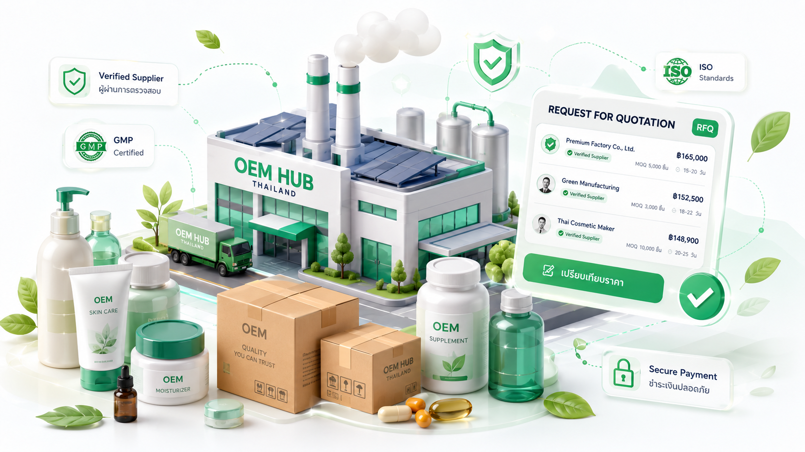
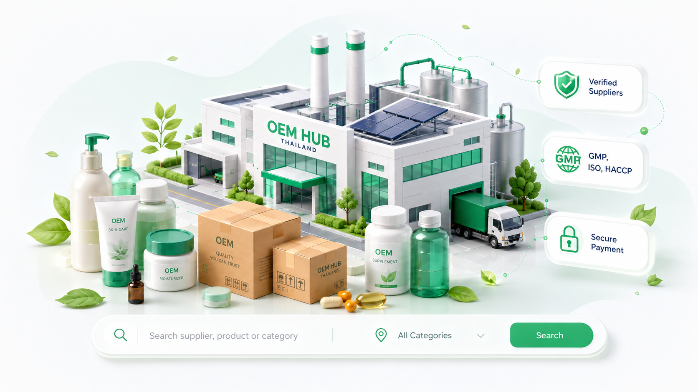
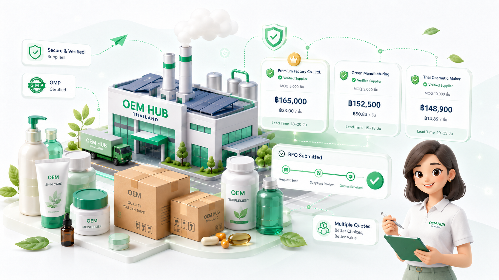

# OEM Hub Thailand

OEM Hub Thailand is a Next.js B2B marketplace for Thai brand builders and industrial buyers to discover suppliers, create RFQs, compare quotes, open orders, track work, and review completed deals.

The platform is not a simple supplier directory. Its core value is the transaction workflow inside the system: RFQ -> Quote -> Accepted Quote -> Order -> Direct Buyer Payment -> Supplier Order Activation Fee -> Work Timeline -> Completion -> Review.

## Preview

### Public Marketplace



### Supplier Discovery



### RFQ Flow



## Current Stack

- Next.js App Router
- TypeScript
- Tailwind CSS
- shadcn-style local UI components
- Supabase foundation for Phase 1 backend
- Mock/seed data for the first implementation phase

## Run Locally

Install dependencies:

```bash
npm install
```

Start the dev server:

```bash
npm run dev
```

Build for production:

```bash
npm run build
```

Type-check:

```bash
npm run typecheck
```

## Main Routes

Public marketplace:

- `/`
- `/categories`
- `/categories/[slug]`
- `/suppliers`
- `/suppliers/[slug]`
- `/services/[slug]`
- `/rfq/new`
- `/how-it-works`
- `/pricing`
- `/contact`

Dashboards:

- `/dashboard/buyer`
- `/dashboard/buyer/rfq/[id]`
- `/dashboard/supplier`
- `/dashboard/supplier/rfqs`
- `/admin`
- `/admin/supabase-status`

## Project Structure

- `app/` - Next.js pages and routes
- `components/` - reusable UI and business widgets
- `components/ui/` - local primitive UI components
- `lib/data.ts` - marketplace mock data
- `lib/commerce.ts` - current commerce/payment/order domain model
- `lib/supabase/` - Supabase client helpers and TypeScript foundation types
- `supabase/migrations/` - SQL schema foundation for Supabase
- `public/images/` - static assets

## Supabase Phase 1

Phase 1 has started with Supabase as the backend provider.

Setup steps:

1. Create a Supabase project.
2. Copy `.env.example` to `.env.local`.
3. Fill `NEXT_PUBLIC_SUPABASE_URL` and `NEXT_PUBLIC_SUPABASE_ANON_KEY`.
4. Run `supabase/migrations/20260706000000_phase_1_foundation.sql` in Supabase SQL Editor.
5. Open `/admin/supabase-status` to verify the connection.

Do not commit `.env.local` or any real secret keys.

## Important Context

Before making product or code decisions, read:

- `PROJECT_BRIEF.md`
- `BUSINESS_RULES.md`
- `FEATURE_GOVERNANCE.md`
- `PHASE_1_PLAN.md`
- `AGENTS.md`

These files describe the business model, workflow, user roles, payment rules, and AI-agent working rules for this project.
